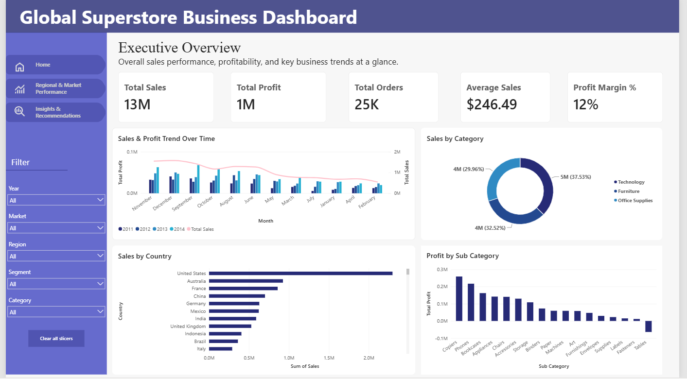
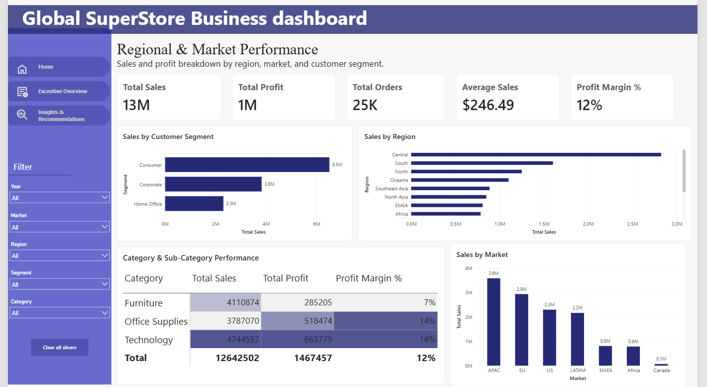
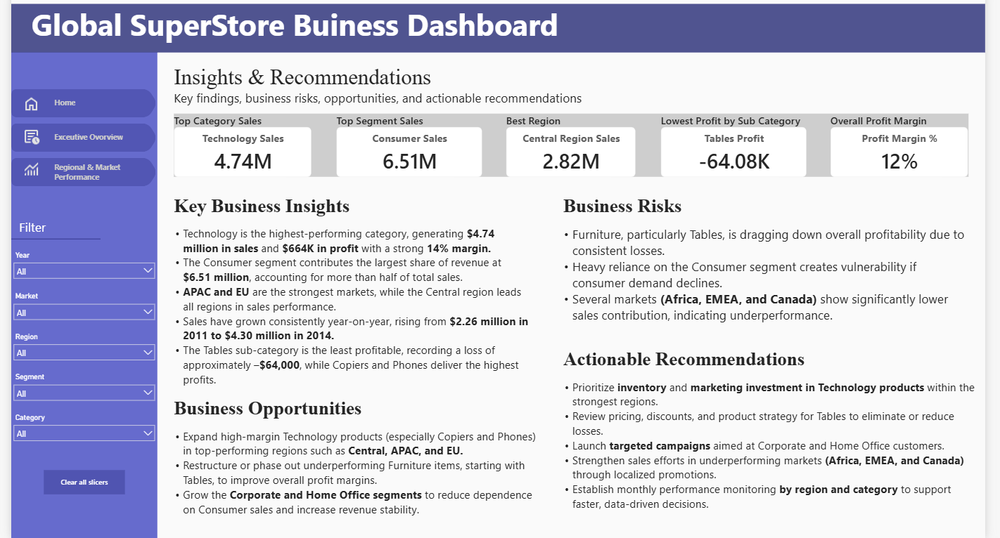

# Global Superstore Business Intelligence & Data Science Project

<div align="center">


</div>

**AnalystLab Africa Consulting | Data Analytics & Data Science Internship**  
**Analyst:** Ozoeze Wilord Ugonna

**Dataset:** Global Superstore (51,290 transactions | 147 countries | 2011–2014)  
https://www.kaggle.com/datasets/apoorvaappz/global-super-store-dataset

---

## 📌 Project Overview

This repository contains the end-to-end analysis of the Global Superstore dataset, progressing from Business Intelligence dashboarding to advanced statistical analysis and feature engineering in preparation for machine learning.

| Week | Focus | Status |
|------|--------|--------|
| **Week 2** | Interactive Power BI Dashboard & Executive Reporting | Completed |
| **Week 3** | Advanced EDA, Statistical Validation & Feature Engineering | Completed |
| **Week 4** | Machine Learning Model Development | Upcoming |

---

# 🟦 WEEK 2 — Business Intelligence Dashboard

**Week 2 Project | Data Analytics Internship – AnalystLab Africa Consulting**

## Business Problem

Management lacked a single, interactive view of business performance. Key questions that needed answering included:

- What is the overall sales performance of the company?
- Which regions and markets generate the highest sales and profit?
- Which customer segments contribute the most revenue?
- Which product categories and products are most profitable?
- What trends can be observed over time?
- What recommendations should management implement?

## Project Workflow

### 1. Data Preparation (Power Query)
- Converted Order Date and Ship Date from text to Date format
- Trimmed trailing spaces in Product Name
- Changed Postal Code data type to Text
- Created helper columns: Year, Month, Month Number
- Checked for missing values, duplicates, and data quality issues
- Validated logical consistency (e.g., Ship Date ≥ Order Date)

### 2. Dashboard Development (Power BI)
**KPI Cards**
- Total Sales
- Total Profit
- Total Orders
- Average Sales
- Profit Margin %

**Visualizations**
- Line Chart – Sales & Profit Trend over Time
- Donut Chart – Sales by Category
- Bar Charts – Sales by Region, Sales by Customer Segment
- Column Chart – Sales by Market
- Matrix – Category & Sub-Category Performance

**Interactivity**
- Slicers for Year, Market, Region, Segment, and Category

### 3. Business Insights & Recommendations
- 5 Key Business Insights
- 3 Business Risks
- 3 Business Opportunities
- 5 Actionable Recommendations

## Key Insights (Week 2)

| Insight | Finding |
|---------|---------|
| Top Category | Technology ($4.74M sales, 14% margin) |
| Top Segment | Consumer (over 50% of total revenue) |
| Top Region | Central Region |
| Top Market | APAC |
| Growth Trend | Consistent year-on-year growth (2011–2014) |
| Profit Challenge | Tables sub-category recorded losses |

## Tools Used (Week 2)
- Microsoft Power BI Desktop
- Power Query
- DAX
- Global Superstore Dataset

## Dashboard Screenshots

**Executive Overview**  


**Regional & Market Performance**  


**Insights & Recommendations**  


## Week 2 Reports
- [Business Intelligence Overview Report](./BI_Overview_Report.md)
- [Executive Summary Report](./Executive_Summary_Report.md)

---


# 🟩 WEEK 3 — Advanced Data Analysis, Statistical Validation & Feature Engineering

**Week 3 Project | Data Science Internship – AnalystLab Africa Consulting**

## Objective

Build on the cleaned Week 2 dataset to perform deeper analysis, validate key business assumptions with statistical tests, engineer meaningful features, and produce a modelling-ready dataset for Week 4 machine learning.

## What Was Done

- Advanced Exploratory Data Analysis (new insights, not a repeat of Week 1/2 charts)
- **4 statistical hypothesis tests** with full documentation (H₀, H₁, method, p-value, business meaning)
- **4 engineered features** with clear business justification
- Feature evaluation and selection decisions
- Export of a final modelling dataset
- Business Insights & Recommendations Report

## Key Findings (Week 3)

- Overall profit margin ≈ **11.6%**
- **24.5%** of orders are loss-making
- Discounted orders average **−$13.60** profit vs **+$61** for non-discounted orders
- **Technology** has the highest average profit; **Furniture** has the highest loss rate (~32%)
- Discount policy is a major driver of margin leakage

## Statistical Tests Performed

1. **Kruskal-Wallis** – Profit across Categories  
2. **Mann-Whitney U** – Discounted vs Non-discounted Profit  
3. **Chi-Square** – Segment vs Order Priority  
4. **Spearman correlations** – Sales, Discount, Shipping Cost vs Profit  

## Engineered Features

| Feature | Description |
|---------|-------------|
| `Profit_Margin` | Profit ÷ Sales |
| `Is_Loss_Making` | 1 if Profit < 0, else 0 |
| `Discount_Impact` | Sales × Discount |
| `Shipping_Efficiency` | Shipping Cost ÷ Sales |
| `Days_to_Ship` | Ship Date − Order Date (days) |

## Tools Used (Week 3)
- Python (Pandas, NumPy, SciPy, Matplotlib, Seaborn)
- Jupyter Notebook
- GitHub

## Week 3 Reports
- [Project Continuity Summary](./reports/01_Project_Continuity_Summary.md)
- [Statistical Analysis Summary](./reports/02_Statistical_Analysis_Summary.md)
- [Feature Engineering Documentation](./reports/03_Feature_Engineering_Documentation.md)
- [Feature Evaluation & Selection Summary](./reports/04_Feature_Evaluation_Selection_Summary.md)
- [Business Insights & Recommendations Report](./reports/05_Business_Insights_Recommendations_Report.md)

---

## 📁 Project Structure

```text
global-superstore-business-analysis/
├── data/
│   └── modelling/
│       └── global_superstore_modelling_dataset.csv
├── notebooks/
│   └── week3_advanced_analysis.ipynb
├── reports/
│   ├── 01_Project_Continuity_Summary.md
│   ├── 02_Statistical_Analysis_Summary.md
│   ├── 03_Feature_Engineering_Documentation.md
│   ├── 04_Feature_Evaluation_Selection_Summary.md
│   └── 05_Business_Insights_Recommendations_Report.md
├── screenshots/
│   ├── executive-overview.png
│   ├── regional-performance.png
│   └── insights-recommendations.png
├── Global_Superstore_Dashboard.pbix
├── BI_Overview_Report.md
├── Executive_Summary_Report.md
├── README.md
└── requirements.txt
```
---

🎓 Skills Demonstrated
Week 2

Data cleaning and transformation (Power Query)
DAX measure development
Interactive dashboard design
Business analysis and data storytelling

Week 3

Advanced exploratory data analysis
Statistical hypothesis testing & interpretation
Feature engineering
Feature evaluation and selection
Preparation of modelling-ready datasets
Professional technical documentation

---

👤 Author
Ozoeze Wilord Ugonna
Junior Data Scientist
AnalystLab Africa Consulting

---

📄 License
This project was completed as part of a professional internship assignment.
